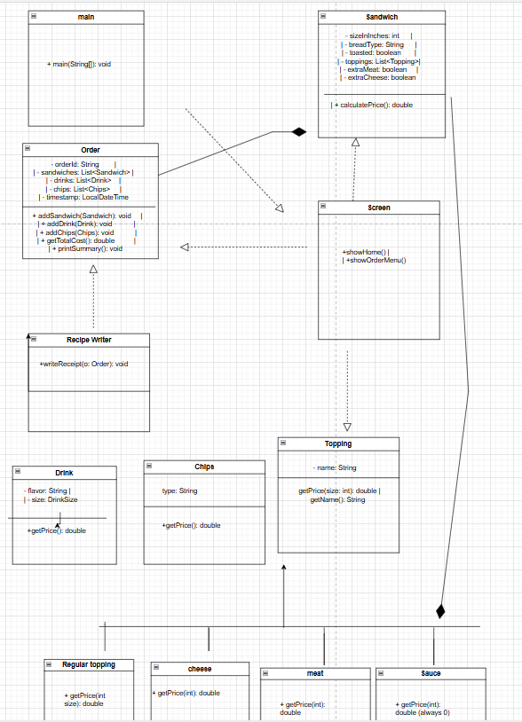

# Sandwich Club

The Sandwich Club is a Java-based console application that simulates a sandwich shop ordering system. Users can build fully customizable sandwiches by choosing size, bread type, toppings, and extras like drinks and chips. It calculates prices in real-time and generates printable receipts for each order.

Purpose:
To give users a fun, interactive experience while practicing object-oriented design in Java.
Intended Users:
This app is built for anyone who wants to explore how sandwich orders are processed in a deli-style menu — students, hobby developers, or instructors assessing Java project design.

Briefly describe what this Java console application does. Mention its purpose and who the intended users are. Explain the main functionality and what problems it aims to solve.

![Class Diagram](path/to/your/class_diagram.png)

## User Stories

As a customer, I want to build a sandwich step-by-step so that I can customize my order.

As a customer, I want to choose extra meat or cheese so that I get more flavor for a small extra cost.

As a customer, I want to see a price summary so I can review my total before checkout.

As a customer, I want to receive a printed receipt so that I have proof of my order.

## Setup

- IntelliJ IDEA

- Java SDK 17+ installed and configured in IntelliJ

### Prerequisites

Open IntelliJ IDEA.

Click Open and navigate to your project folder.

Wait for the IDE to index and detect Java files.

In the src/com/sandwichclub/ folder, open Main.java.

Right-click and choose Run 'Main.main()' to launch the applicatio

### Running the Application in IntelliJ

Follow these steps to get your application running within IntelliJ IDEA:

1. Open IntelliJ IDEA.
2. Select "Open" and navigate to the directory where you cloned or downloaded the project.
3. After the project opens, wait for IntelliJ to index the files and set up the project.
4. Find the main class with the `public static void main(String[] args)` method.
5. Right-click on the file and select 'Run 'YourMainClassName.main()'' to start the application.

## Technologies Used

- Java 17+

- IntelliJ IDEA

- Java I/O (FileWriter) for saving receipts

- OOP Design: Abstraction, Inheritance, Composition, and Polymorphism
## Demo

Include screenshots or GIFs that show your application in action. Use tools like [Giphy Capture](https://giphy.com/apps/giphycapture) to record a GIF of your application.

path/to/your/screenshot.png)

## Future Work

- Online Ordering Platform
- Customer Profiles
- Add support for discounts
- Delivery & Pickup Options
- 

## Resources

List resources such as tutorials, articles, or documentation that helped you during the project.

- [Java Programming Tutorial](https://www.example.com)
- [Effective Java](https://www.example.com)
- [google]
- [Potato sensei]
## Team Members

- Amena developer

## Thanks

Express gratitude towards those who provided help, guidance, or resources:

- Thank you to Raymond Maroun for continuous support and guidance.
- A special thanks to all teammates for their dedication and teamwork.
 